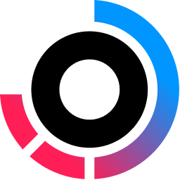

<h1 align="center">Hello there ✨</h1>

  Enthusiast of programming and dark music. Admirer of clean code. Backend & Frontend Developer

- [Gitlab](https://gitlab.com/Mnigos)
- [LinkedIn](https://www.linkedin.com/in/igor-makowski-b30684206)

 

  

### Favorite Technologies

-  Nextjs
-  Nestjs
-  TypeScript

### 📚 What I'm currently learning

-  Prisma
-  tRPC
-  Turborepo

<h2 align="center">Know and using</h2>

<a title="Storybook" href="https://storybook.js.org/">
  

<a title="SWC" href="https://swc.rs/">
  

<h2 align="center">Heard or tried</h2>

<a title="Flask" href="https://flask.palletsprojects.com/">
  

<h2 align="center">Stats</h2>

  

  

  

